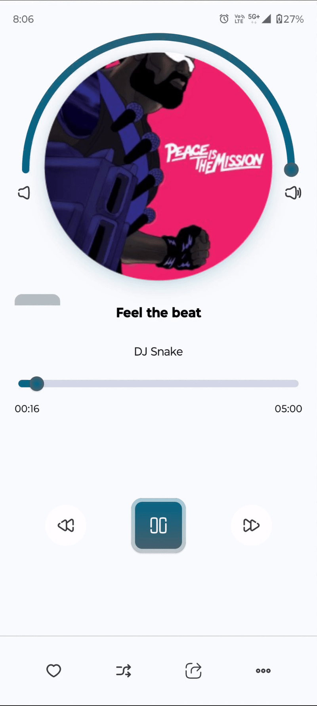
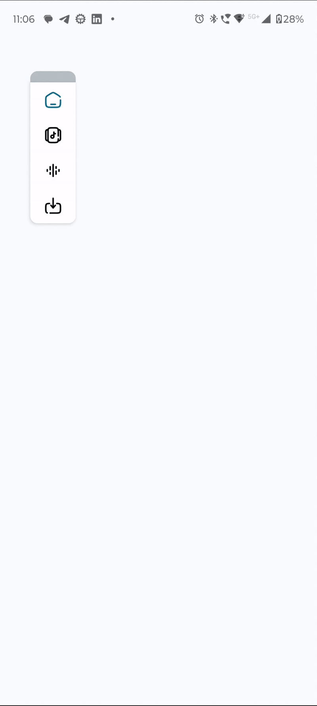

# compose-ui-examples
making complex ui using compose 

### Demo
|  |  |  |
|----------------------------------------|:----------------------------------------:|----------------------------------------------|
